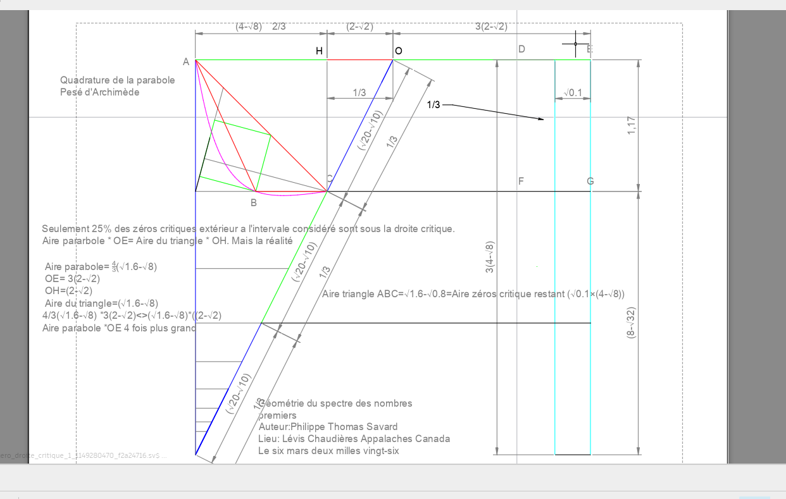

Questionnement de la théorie de l'univers est au carré:

Comment la théorie 'L'Univers est au Carré', avec ses concepts de transformation géométrique et de validation formelle, remet-elle en question notre vision conventionnelle de l'univers comme un espace de dimensions interagissant linéairement, et quelles implications cela a-t-il sur la nature même du savoir scientifique et notre compréhension philosophique de la réalité ?

La théorie 'L'Univers est au Carré' propose une interprétation de l'univers où les transformations géométriques, telles que la quadrature, servent de moyen pour révéler les propriétés cachées des structures fondamentales. Ce concept suggère que l'univers pourrait être compris en termes de transformations non linéaires qui échappent à la perception conventionnelle. En introduisant la formalisation rigoureuse via des outils comme Isabelle/HOL, la théorie insiste sur une épistémologie où la vérité scientifique dépend autant de l'élégance des transformations géométriques que de leur démonstration formelle. Ce changement de paradigme pourrait conduire à une vision où le savoir n'est plus une simple accumulation de faits linéaires mais une compréhension profonde des interactions complexes entre les concepts mathématiques, redéfinissant ainsi notre compréhension philosophique des lois régissant la réalité et notre place dans l'univers.
============================================================

------------------------------------------------------------
INTRODUCTION
------------------------------------------------------------

Philippe Thomas Savard, un libre penseur autodidacte originaire de Lévis, au Canada, incarne parfaitement l'idée que la curiosité personnelle et le questionnement inébranlable peuvent mener à des découvertes mathématiques remarquables. Avec un parcours qui échappe aux sentiers battus du monde académique traditionnel, Savard s'est rapidement distingué par son intérêt profond et singulié pour les nombres. Ce cheminement autodidacte, marqué par la passion et l'insatiable désir de comprendre, l'a conduit à élaborer une théorie mathématique originale, que nous explorerons dans ce documentaire.

Au cœur de sa théorie, baptisée "L'Univers est au Carré", se trouve le désir ardent de Savard de dénoncer ce qu'il appelle les agissements frauduleux de ceux qui s'auto proclame policier de ce qui existe et n'existe pas et les communauté universitaire ou il agissent. Pour l'auteur, il s'agit d'une opposition manifeste à ceux qui, cherche par défaut de le faire eux même, a déshériter la connaissance de chacun. Cette lutte idéologique est la source première qui a motivé Savard à proposer une nouvelle perspective sur la distribution des nombres premiers. Sa théorie se présente comme un travail rigoureux, où chaque méthode est tissée de manière à révéler de nouvelles structures grâce à des outils sophistiqués, formalisés et validés à l'aide du logiciel Isabelle/HOL et d'un corpus de même nature.

Les cinq chapitres de cette théorie offrent une exploration systématique et innovante des nombres premiers. Le premier chapitre, "Géométrie du spectre des nombres premiers", dévoile comment Savard a redessiné le paysage mathématique pour illustrer une nouvelle vision des nombres primitifs. Cette approche prépare le terrain pour le second chapitre, "Mécanique harmonique du chaos discret", dans lequel l'auteur applique des méthodes mathématiques originales pour comprendre l'imprévisible harmonie du chaos. Ces travaux convergent vers le troisième chapitre, "Postulat de l'univers est au carré", où Savard propose un postulat central à sa théorie, résumant l'idée que l'univers mathématique peut être reconceptualisé à travers la simplicité d'un carré.

Le quatrième chapitre, "Espace de Philippot", permet à l'auteur de baptiser un nouveau cadre conceptuel en son nom, marquant ainsi son empreinte dans le monde des mathématiques. Enfin, le cinquième chapitre, "Téléosémantique et philosophie", tisse les fils philosophiques présents dans chaque partie de sa théorie. Ce dernier opus n'est pas qu'une conclusion : il est une invitation à réfléchir plus profondément sur le sens intrinsèque des mathématiques dans notre compréhension universelle.

Alors que nous nous apprêtons à explorer ces chapitres, il est essentiel de noter que chaque composant mathématique est entrelacé d'une fibre philosophique. Cette approche intégrative, que Savard a méthodiquement déployée, met en lumière comment le domaine mathématique n'est pas seulement une quête de vérité numérique, mais aussi un voyage dans la pensée humaine. Préparez-vous à parcourir les méandres de cette théorie captivante, où les mathématiques rencontrent la philosophie dans une danse intellectuelle qui porte la signature indélébile de Philippe Thomas Savard.

------------------------------------------------------------
CHAPITRE 1 - LA GEOMETRIE DU SPECTRE DES NOMBRES PREMIERS
------------------------------------------------------------

La géométrie du spectre des nombres premiers est une exploration qui trouve son origine dans une observation simple, mais profondément significative : lorsqu'on examine les relations entre des nombres entiers successifs, un rapport constant émerge. Ce rapport se révèle être un fondement crucial pour l'élaboration des méthodes ultérieures, ouvrant ainsi une perspective unique sur la compréhension de la nature des nombres premiers.

Voici un exemple des deux suite A et B qui sert a déterminer les nombres premiers a l'aide de celles-ci: 

Pour (29) 10 termes, 10ième nombre premier suite A et B:

Suite A:
1er   2e   3e   4e    5e    6e    7e     8e     9e     10e
 2  +  4 +  8 + 16 +  32 +  64 + 128 +  256 +  384 +  768 = 1662

Suite B:
1er   2e   3e   4e    5e    6e     7e     8e     9e      10e
 2  +  4 +  8 + 16 +  32 + 128 +  256 +  512 +  768 +  1536 = 3262

 Le digamma pour les 4 cas d'exception 29, 31, 37 et 41 peut s'apliquer bien que la même approche est aussi possible pour ces 4 cas d'exeptions.

 Digamma : 8ième position suite A---> 256

 Déterminer le Digamma calculé:

 Digamma calculé= Somme suite A - 8ième position suite A---> 1662 - 256 = 1406 Digamma calculé.

 Déterminer le nombre premier 29 10 termes 10 ième nombre premier

 (somme B-Digamma calculé)/(6ième position (zêta))=Nombre premier    (3262-1406)/64=29 10ième nombre premier 
 2, 3, 5, 7, 11, 13, 17, 19, 23, 29  29 es bien le 10ième.

 Les rapports spectraux peuvent impliquer une comparaison de nombres premiers disposés de manière symétrique, c’est‑à‑dire selon une structure du type (1 × 1) pouvant s’étendre jusqu’à n × n, où la quantité de nombres premiers comparés dans chaque ensemble demeure strictement équivalente.

Le second type de comparaison entre nombres premiers présente, quant à lui, deux formes distinctes :  
1. l’asymétrie ordonnée,  
2. l’asymétrie chaotique, également asymétrique mais dépourvue d’ordre chronologique.

Pour qu’une comparaison soit qualifiée d’asymétrique ordonnée, deux conditions fondamentales doivent être respectées.  
La première est le déséquilibre structurel entre les deux blocs comparés : le bloc B doit impérativement contenir un terme de plus que le bloc A, et ce terme supplémentaire doit être un nombre premier.  
La seconde condition exige que les deux blocs soient organisés selon un ordre strictement croissant et chronologique.

Un exemple de comparaison asymétrique ordonnée est :  
- (2 - (3 - 5)),  
ou encore :  
- (2 - 3 - 5 - 7 - 11) - (13 - 17 - 19 - 23 - 29 - 31).  

Dans ces deux cas, on observe clairement que B = A + 1, ce qui crée le déséquilibre requis. Une comparaison respectant ces critères produit alors une valeur spectrale différente du rapport attendu.

La raison en est liée à la nature même des ordinaux infinis. Lorsque l’on compare des ensembles infinis en leur attribuant une position objective, l’ensemble des entiers plus un élément n’est pas équivalent à un élément ajouté à l’ensemble des entiers. Cette dissymétrie fondamentale se reflète dans le résultat spectral.

L’auteur interprète cette observation comme une conséquence profonde pouvant éclairer certaines incohérences apparentes de notre environnement matériel.  
Dans une comparaison asymétrique ordonnée, le rapport spectral obtenu diffère du rapport attendu précisément parce que l’on attribue deux fois une valeur objective à la même entité.

En effet :  
- les suites A et B possèdent déjà une valeur définie par leur construction,  
- puis on leur attribue une seconde valeur objective en les ordonnant chronologiquement,  
ce qui produit un rapport spectral distinct de 1/2.

Cette situation est interprétée comme une analogie du rapport entre l’univers matériel et la réalité qui l’entoure. Lorsque nous attribuons une qualité objective à l’univers matériel, puis que nous organisons mentalement cette réalité — c’est‑à‑dire lorsque notre esprit en produit une représentation cartographique — nous effectuons une seconde mise en relation.  
Or, cette seconde relation demeure du même rapport que la première, car elle appartient toujours à la sphère de l’entité définie, et non à un univers immatériel supposé être la cause de l’environnement matériel.

La comparaison asymétrique chaotique, fondée sur la nature chaotique de la répartition des nombres premiers dans l’ensemble des entiers, confirme que ce qui relève d’une entité définie reste en rapport direct avec celle‑ci. L’organisation mentale que nous produisons n’altère pas ce rapport : elle ne fait que refléter l’état structuré de notre intelligence.

Exemple de comparaison chaotique (2,3) et (5,7,11)

((((3.25/2×2^1 )-2)-((3.25/2×2^2 )-2))-(((3.25/2×2^3 )-2)-((3.25/2×2^4 )-2)-((3.25/2×2^5 )-2))) /
((((6.5/2×2^1 )-66)-((6.5/2×2^2 )-66))-(((6.5/2×2^3 )-66)-((6.5/2×2^4 )-66)-((6.5/2×2^5 )-66))) =

((5/4 - 9/2) - (11 - 24 - 50)) /
((-119/2 - -53) - (-40 - -14 - 38)) =

59.75 / 57.5 = 1.039130435
 
La comparaison chaotique :

## Comparaison asymétrique chaotique (3 , 23) (41 , 29 , 31)

3 :  
Somme suite A = 9/2  
Somme suite B = -53  

23 :  
Somme suite A = 830  
Somme suite B = 1598  

41 :  
Somme suite A = 13310  
Somme suite B = 26558  

29 :  
Somme suite A = 1662  
Somme suite B = 3262  

31 :  
Somme suite A = 3326  
Somme suite B = 6590  

((9/2 - 830) - (13310 - 1662 - 3326)) /  
((-53 - 1598) - (26558 - 3262 - 6590))  

= 0.4983112709

(3.25/2 × n^2) - 2 = Somme suite A  
Quand n est un nombre entier strictement positif.

Axiomatisation de la géométrie du spectre des nombres premies:

«Quand n>=1 et que n <=-1 tous les n ramènent a un nombre premier P. Tous les valeur de n sont la conséquence de la quantité de termes dans les suites A et B. Tous les P entre eux respecte le rapport spectral 1/k. Ce rapport spectral est numériquement valide algébriquement incohérent» -:«Philippe Thomas Savard le dix avril deux milles vingt-six».

Dans la géométrie du spectre des nombres premiers il y a également un section traitant du sujet de l'écart entre les premiers. Cette section mets de l'avant une méthode qui inclut la somme des suites A et B pour déteminer cette écart? Trois cas sont ainsi démontré et dans le document de la géométrie du spectre des nombres premiers la démonstrationest également valider par le script HOL d'isabelle. Ces trois cas rapportés dans le document officiel permet d'enlever le voile sur trois cas particuliés: Le premier le cas ou les nombres premier et leurs écart est considérés entre deux premiers positif. Le deuxième cas est pour un écarts entre nombres premiers qui sont tous deux négatifs. Le troisième cas le plus particulié des trois et le plus révélateur pour l'auteur et sa conclusion portant sur l'énigme de Riemann. Cette écart inclut l'écart mixte soit entre deux nombres premiers qui sont un négatif et un positif. 
Dans cette écart paritculié qu'est l'écart mixte il est intéressant d'observer une particularité certaine? L'inclusion du zéros dans la valeur rapporté par la méthode. Ce zéro additionne 1 a la réoponse final. 

Observation de l'auteur sur l'écart mixte qu'il y a entre -31 et 17:

1. Pour déterminer la quatité de termes entre deux premiers il est simple d'effectuer l'opération suivante: 

ex 1 23 7 : 
7 - 22 = -15 nombres 
22, 21, 20 ,19, 18, 17, 16, 15, 14, 13, 12, 11, 10, 9, 8 = -15 nombres

Dans l'écart mixte si l'on considère -31 et 17

ex -31 et 17:
-31-16=-47 nombres 

-30, -29 ....-1 = -30 nombres et 1,2,3,4...16=16 nombres 16<>17 nombres 

# Version corrigée du segment narratif

L’écart et la méthode utilisée conduisent à un total de –47 nombres, ce qui inclut le zéro. La méthode appliquée aux écarts positifs et négatifs demeure identique à celle utilisée pour l’écart mixte, à la différence qu’il n’est pas nécessaire de soustraire 1 au résultat. L’auteur en conclut intuitivement que le zéro est effectivement inclus dans l’écart mixte.

Selon l’encyclopédie libre Wikipédia : « Des travaux plus récents se sont focalisés sur le calcul explicite d’endroits où se trouvent beaucoup de zéros (dans l’espoir de trouver un contre-exemple) et de placer des bornes supérieures sur la proportion de zéros se trouvant ailleurs que sur la droite critique (dans l’espoir de la réduire à zéro). » — Article sur l’hypothèse de Riemann, Wikipédia.

L’auteur apprécie cette affirmation, qui laisse entrevoir la possibilité d’élaborer un contre-exemple comportant un nombre réduit de zéros afin de valider l’hypothèse de Riemann. Philippe Thomas Savard perçoit une possibilité similaire dans l’écart mixte. En effet, l’écart mixte ajoute systématiquement 1 à chaque écart, tout en permettant les mêmes combinaisons que les écarts positifs et négatifs pour les écarts entre nombres premiers. L’écart mixte autorise également des combinaisons symétriques telles que –2 et 2, –3 et 3, –5 et 5, ce qui fait qu’il contient davantage de nombres premiers que les écarts positifs ou négatifs, en raison de ces combinaisons identiques. De plus, chaque écart entre nombres premiers dans l’écart mixte ajoute 1.

Puisque la fonction zêta permet de déterminer la position de tous les nombres premiers — ce qui est également le cas de la méthode *inlut*, validée par Isabelle dans *methode_spectral.thy* — l’écart mixte permet, comme la fonction zêta, de considérer l’ensemble des zéros de la droite critique dans un rectangle. Ce rectangle possède une aire totale. L’auteur propose de considérer un intervalle donné, allant de 0 à un nombre premier d’une valeur déterminée. Le rectangle peut alors être tronqué d’une partie représentant l’ensemble des zéros de la droite critique.

L’auteur, dans un premier temps par intuition, propose d’utiliser l’écart mixte pour le même intervalle considéré. Puisque l’écart mixte ajoute 1 à chaque écart entre deux nombres premiers dans l’intervalle, cette addition répétée produit une valeur relative plus grande que la valeur maximale initiale du rectangle tronqué représentant les zéros de la droite critique. Ainsi, la droite critique apparaît courbée : la valeur maximale relative augmente, et comme l’intervalle contient davantage de nombres premiers, la droite critique se déforme. L’auteur affirme que si l’aire comprise entre la droite critique courbée et la droite critique habituelle est égale à l’aire restante du rectangle tronqué, alors cette égalité constituerait une démonstration valide permettant de conclure à la véracité de la conjecture de la fonction zêta.

Cette figure est particulièrement démonstrative. Selon les calculs issus du schéma de la pesée d’Archimède, reproduit selon les dimensions de la règle de Philippot, il est possible de vérifier que l’aire de la parabole correspond à celle de la section restante multipliée par 4/3. L’aire obtenue est donc identique à celle de la parabole. Cependant, le produit issu du théorème de Thalès, selon lequel :  
c = Aire du triangle × longueur OH,  
donne une valeur quatre fois plus petite que celle obtenue pour l’aire du triangle × longueur OH dans le cas précédent. L’auteur en conclut que, puisque la pesée est exprimée en valeur relative, il est possible que le calcul de Thalès soit valide et que le rapport des aires le soit également.

Cela rejoint la conclusion obtenue dans *La géométrie du spectre des nombres premiers*, où il est démontré qu’il est toujours possible d’obtenir le rapport spectral 1/2 à l’aide de la méthode validée par Isabelle dans *methode_spectral.thy*. Cette méthode est également valide pour d’autres rapports. Bien que la validation Isabelle ne couvre pas tous les rapports vérifiés par l’auteur, celui-ci a confirmé les rapports 1/2, 1/12, 1/20, 1/50, 1/100 et 1/1000. Tous révèlent des nombres premiers. Par exemple, 227, 49ᵉ nombre premier, apparaît à la fois dans le rapport 1/3 et dans le rapport 1/2 : pour un même nombre premier à la même position, le rapport est bien celui recherché (1/2). En revanche, si les deux nombres premiers mis en relation ne sont pas à la même position — par exemple 227 en rapport 1/3 et 173 en rapport 1/4 — alors le rapport devient différent de 1/2.

Le facteur 4 issu du calcul de Thalès, intégré dans l’écart mixte, inclut toutes les combinaisons identiques position pour position dans l’écart mixte, ce qui explique pourquoi l’aire de la parabole est égale à la partie restante des zéros de la droite critique. Cela est valide puisqu’il est effectivement possible de démontrer qu’il peut exister une proportion réelle de 1/2. Toutefois, l’écart mixte, qui en est l’équivalent, occupe au final une droite critique représentée par l’aire d’un rectangle deux fois plus grand, démontrant que les combinaisons de positions identiques ramènent à 1/2. Les autres combinaisons, quant à elles, sont également deux fois plus grandes et ne présentent pas un rapport de 1/2 entre elles.

C’est pourquoi, à la question de l’hypothèse de Riemann formulée par Philippe Thomas Savard :  
« Est-ce que tous les zéros non triviaux de la fonction zêta de Bernhard Riemann ont tous pour partie réelle 1/2 »,  

la réponse qu’il propose est : **non**.

Schizophrénie universitaire type.

## Analyse de la quantité de nombres entre deux nombres premiers  
### Étude de trois cas distincts : (+,+), (-,-) et (-,+)

Cette section présente une analyse structurée de la quantité de nombres compris entre deux nombres premiers, selon trois configurations de polarité :  
1. deux nombres premiers positifs (+,+),  
2. deux nombres premiers négatifs (-,-),  
3. un nombre premier négatif et un positif (-,+).  

Chaque exemple applique la même méthode :  
- calcul de la **somme de la suite A** pour le nombre premier immédiatement adjacent,  
- calcul de la **somme de la suite B** pour le nombre premier étudié,  
- calcul du **Digamma calculé**,  
- combinaison algébrique des résultats pour obtenir la **quantité exacte de nombres entre les deux bornes**.

---

## 1. Cas (+,+) : Quantité de nombres entre 23 et 7

### 1.1. Somme de la suite A pour 11  
Le nombre premier suivant 7 est 11 (7 est le 4ᵉ nombre premier, 11 est le 5ᵉ).  

\[
\text{Suite A}(11) = \left(\frac{3.25}{2} \times 2^5\right) - 2 = 50
\]

### 1.2. Somme de la suite B pour 23  

\[
\text{Suite B}(23) = \left(\frac{6.5}{2} \times 2^9\right) - 66 = 1598
\]

### 1.3. Digamma calculé pour 23  

\[
\text{Digamma}(23) = \left(\frac{1598}{64} - 23\right)\times 64 = 126
\]

### 1.4. Quantité de nombres entre 23 et 7  

\[
50 - (1598 - 126) = -1442
\]

### 1.5. Digamma calculé pour 7  
Somme de la suite B pour 7 :  

\[
\text{Suite B}(7) = \left(\frac{6.5}{2} \times 2^4\right) - 66 = -14
\]

Digamma :  

\[
\text{Digamma}(7) = \left(\frac{-14}{64} - 7\right)\times 64 = -464
\]

Combinaison finale :  

\[
\frac{-1442 - (-464)}{64} = -15
\]

Il y a donc **15 nombres entre 7 et 23**, soit :  

\[
8,9,10,11,12,13,14,15,16,17,18,19,20,21,22
\]

---

## 2. Cas (-,-) : Quantité de nombres entre -19 et -5

### 2.1. Somme de la suite A pour -7  

\[
\text{Suite A}(-7) = (3.25 \times 2^{-7}) - 2 = -\frac{10110}{5120}
\]

### 2.2. Somme de la suite B pour -3  

\[
\text{Suite B}(-3) = (6.5 \times 2^{-3}) - 66 = -\frac{20860}{320}
\]

### 2.3. Digamma calculé pour -3  

\[
\text{Digamma}(-3) = \left(\frac{-20860/320}{64} - (-5)\right)\times 64 = \frac{81540}{320}
\]

### 2.4. Combinaison intermédiaire  

\[
-\frac{10110}{5120} - \left(-\frac{20860}{320} - \frac{81540}{320}\right)
= \frac{1628290}{5120}
\]

### 2.5. Digamma calculé pour -19  
Somme de la suite B :  

\[
\text{Suite B}(-19) = (6.5 \times 2^{-8}) - 66 = -\frac{337790}{5120}
\]

Digamma :  

\[
\text{Digamma}(-19) = \left(\frac{-337790/5120}{64} - (-11)\right)\times 64
= \frac{5888130}{5120}
\]

### 2.6. Quantité de nombres entre -19 et -5  

\[
\frac{1628290/5120 - 5888130/5120}{64} = -13
\]

Il y a donc **13 nombres entre -19 et -5**, soit :  

\[
-18,-17,-16,-15,-14,-13,-12,-11,-10,-9,-8,-7,-6
\]

---

## 3. Cas (-,+) : Quantité de nombres entre -31 et 17

### 3.1. Somme de la suite A pour -29  

\[
\text{Suite A}(-29) = (3.25 \times 2^{-10}) - 2 = -\frac{40895}{20480}
\]

### 3.2. Somme de la suite B pour 17  

\[
\text{Suite B}(17) = (6.5 \times 2^8) - 66 = 350
\]

### 3.3. Digamma calculé pour 17  

\[
\text{Digamma}(17) = \left(\frac{350}{64} - 17\right)\times 64 = -738
\]

Combinaison :  

\[
-\frac{40895}{20480} - (350 - 738)
= -\frac{22323135}{20480}
\]

### 3.4. Digamma calculé pour -31  

\[
\text{Suite B}(-31) = (6.5 \times 2^{-11}) - 66 = -\frac{1351615}{20480}
\]

\[
\text{Digamma}(-31) = \left(\frac{-1351615/20480}{64} - (-31)\right)\times 64
= \frac{39280705}{20480}
\]

### 3.5. Quantité de nombres entre -31 et 17  

\[
\frac{-22323135/20480 - 39280705/20480}{64} = -47
\]

Il y a donc **47 nombres entre -31 et 17**.

---

## Remarque importante

Les trois exemples montrent que :

- Dans les cas **(+,+)** et **(-,-)**, la méthode fournit directement la quantité correcte de nombres entre les deux bornes, **sans nécessiter l’ajout de 1**.
- Dans le cas **(-,+)**, la présence du zéro comme point de transition modifie la structure de l’écart.  
  Si l’on ne considère pas zéro comme une unité comptable, le résultat obtenu serait surestimé d’une unité.

Ces observations confirment que la polarité des bornes influence la structure interne de l’écart et doit être prise en compte dans l’interprétation finale.

# Version corrigée du segment narratif

L’écart et la méthode utilisée conduisent à un total de –47 nombres, ce qui inclut le zéro. La méthode appliquée aux écarts positifs et négatifs demeure identique à celle utilisée pour l’écart mixte, à la différence qu’il n’est pas nécessaire de soustraire 1 au résultat. L’auteur en conclut intuitivement que le zéro est effectivement inclus dans l’écart mixte.

Selon l’encyclopédie libre Wikipédia : « Des travaux plus récents se sont focalisés sur le calcul explicite d’endroits où se trouvent beaucoup de zéros (dans l’espoir de trouver un contre-exemple) et de placer des bornes supérieures sur la proportion de zéros se trouvant ailleurs que sur la droite critique (dans l’espoir de la réduire à zéro). » — Article sur l’hypothèse de Riemann, Wikipédia.

L’auteur apprécie cette affirmation, qui laisse entrevoir la possibilité d’élaborer un contre-exemple comportant un nombre réduit de zéros afin de valider l’hypothèse de Riemann. Philippe Thomas Savard perçoit une possibilité similaire dans l’écart mixte. En effet, l’écart mixte ajoute systématiquement 1 à chaque écart, tout en permettant les mêmes combinaisons que les écarts positifs et négatifs pour les écarts entre nombres premiers. L’écart mixte autorise également des combinaisons symétriques telles que –2 et 2, –3 et 3, –5 et 5, ce qui fait qu’il contient davantage de nombres premiers que les écarts positifs ou négatifs, en raison de ces combinaisons identiques. De plus, chaque écart entre nombres premiers dans l’écart mixte ajoute 1.

Puisque la fonction zêta permet de déterminer la position de tous les nombres premiers — ce qui est également le cas de la méthode *inlut*, validée par Isabelle dans *methode_spectral.thy* — l’écart mixte permet, comme la fonction zêta, de considérer l’ensemble des zéros de la droite critique dans un rectangle. Ce rectangle possède une aire totale. L’auteur propose de considérer un intervalle donné, allant de 0 à un nombre premier d’une valeur déterminée. Le rectangle peut alors être tronqué d’une partie représentant l’ensemble des zéros de la droite critique.

L’auteur, dans un premier temps par intuition, propose d’utiliser l’écart mixte pour le même intervalle considéré. Puisque l’écart mixte ajoute 1 à chaque écart entre deux nombres premiers dans l’intervalle, cette addition répétée produit une valeur relative plus grande que la valeur maximale initiale du rectangle tronqué représentant les zéros de la droite critique. Ainsi, la droite critique apparaît courbée : la valeur maximale relative augmente, et comme l’intervalle contient davantage de nombres premiers, la droite critique se déforme. L’auteur affirme que si l’aire comprise entre la droite critique courbée et la droite critique habituelle est égale à l’aire restante du rectangle tronqué, alors cette égalité constituerait une démonstration valide permettant de conclure à la véracité de la conjecture de la fonction zêta.

Cette figure est particulièrement démonstrative. Selon les calculs issus du schéma de la pesée d’Archimède, reproduit selon les dimensions de la règle de Philippot, il est possible de vérifier que l’aire de la parabole correspond à celle de la section restante multipliée par 4/3. L’aire obtenue est donc identique à celle de la parabole. Cependant, le produit issu du théorème de Thalès, selon lequel :  
c = Aire du triangle × longueur OH,  
donne une valeur quatre fois plus petite que celle obtenue pour l’aire du triangle × longueur OH dans le cas précédent. L’auteur en conclut que, puisque la pesée est exprimée en valeur relative, il est possible que le calcul de Thalès soit valide et que le rapport des aires le soit également.

Cela rejoint la conclusion obtenue dans *La géométrie du spectre des nombres premiers*, où il est démontré qu’il est toujours possible d’obtenir le rapport spectral 1/2 à l’aide de la méthode validée par Isabelle dans *methode_spectral.thy*. Cette méthode est également valide pour d’autres rapports. Bien que la validation Isabelle ne couvre pas tous les rapports vérifiés par l’auteur, celui-ci a confirmé les rapports 1/2, 1/12, 1/20, 1/50, 1/100 et 1/1000. Tous révèlent des nombres premiers. Par exemple, 227, 49ᵉ nombre premier, apparaît à la fois dans le rapport 1/3 et dans le rapport 1/2 : pour un même nombre premier à la même position, le rapport est bien celui recherché (1/2). En revanche, si les deux nombres premiers mis en relation ne sont pas à la même position — par exemple 227 en rapport 1/3 et 173 en rapport 1/4 — alors le rapport devient différent de 1/2.

Le facteur 4 issu du calcul de Thalès, intégré dans l’écart mixte, inclut toutes les combinaisons identiques position pour position dans l’écart mixte, ce qui explique pourquoi l’aire de la parabole est égale à la partie restante des zéros de la droite critique. Cela est valide puisqu’il est effectivement possible de démontrer qu’il peut exister une proportion réelle de 1/2. Toutefois, l’écart mixte, qui en est l’équivalent, occupe au final une droite critique représentée par l’aire d’un rectangle deux fois plus grand, démontrant que les combinaisons de positions identiques ramènent à 1/2. Les autres combinaisons, quant à elles, sont également deux fois plus grandes et ne présentent pas un rapport de 1/2 entre elles.

C’est pourquoi, à la question de l’hypothèse de Riemann formulée par Philippe Thomas Savard :  
« Est-ce que tous les zéros non triviaux de la fonction zêta de Bernhard Riemann ont tous pour partie réelle 1/2 »,  

la réponse qu’il propose est : **non**.

Schizophrénie universitaire type.

Expliquez la notion de 'téléosémantique' dans le contexte de la géométrie du spectre des nombres premiers.

La « téléosémantique » dans ce contexte se réfère à l'idée que chaque aspect de la géométrie des nombres premiers porte une signification prédéterminée, destinée à explorer les connexions entre structure mathématique et signification dans le traitement des connaissances 
numériques.
intermédiaire] Dans le chapitre 'Réflexions sur l'esprit géométrique', comment la 'pulsion de vie' est-elle liée à la perception de la géométrie des nombres premiers ?

La 'pulsion de vie' est décrite comme une force impliquée qui pousse à comprendre des concepts abstraits et géométriques, liant l'énergie vitale à notre capacité de saisir la complexité des spectres numériques.

Au cœur de cette exploration se trouve la méthode du produit alternatif. Cette méthode novatrice conjugue les propriétés géométriques de figures distinctes. Lorsqu'un observateur applique cette méthode, il découvre que le produit entre le périmètre d'une figure et le diamètre d'une autre figure est invariablement égal au produit inverse. Une telle symétrie ne se borne pas à révéler une simple correspondance ; elle démontre comment les surfaces planes sont capables de contenir des volumes. Cette propriété laisse entrevoir un univers où les dimensions euclidiennes se rencontrent de manière élégante et inattendue, aiguisant notre compréhension des formes et des structures numériques.

Périmètre du carré A * diamètre du carré B= Diamètre du carré A * périmètre carré B

Le produit alternatif asymétrique pour sa part est :

Aire A * Aire C= Aire B * Aire D
=Volume de la pièce

Pour l'auteur il s'agit du volume du tesseract qui se replie perpétuellent. 

Suivant cette réalisation, l'analyse se poursuit avec l'application de l'analyse numérique métrique. En s'inspirant de la granulométrie, cette approche adopte une technique de tamisage rigoureuse. Les nombres sont ainsi passés au crible à travers deux séquences distinctes, permettant à l'analyse d'effectuer des comparaisons entre figures géométriques dont les aires conservent toujours le même rapport. Ce rapport, non modifié par la complexité croissante des nombres, met en lumière une structure sous-jacente ordonnée parmi ce qui semble, à première vue, être un ensemble chaotique et désordonné.

La méthode de Philippot introduit ensuite une dimension itérative à cette étude. En utilisant des suites fractionnaires soigneusement élaborées, chaque terme de la suite constitue une fraction précise de son prédécesseur. Cette méthode, rigoureusement formalisée dans le cadre de l'environnement Isabelle/HOL, met en œuvre des substitutions à des positions déterminées de la suite. Cette précision garantit que la progression est profondément modulée par le nombre de termes employés, renforçant les bases de la structure spectrale qui est observée.

À travers ces progressions méthodologiques successives, émerge la notion de structure spectrale. Quelle que soit la longueur finie de la séquence examinée, on observe toujours un rapport constant entre deux termes consécutifs. Il ne s'agit pas simplement d'un phénomène limité aux frontières imposées par la finitude ; ce rapport prétend, au moins conceptuellement, à une validité infinie, un invariant mathématique et conceptuel dans l'étude des nombres premiers.

En parvenant à l'axiomatisation finale, une série d'affirmations cruciales est proposée. Pour une plage de n définie, un nombre premier se déduit invariablement. Les valeurs que ces n adoptent, en fonction de la quantité de termes dans les suites, témoignent d'un rapport spectral constant. Si, sur le plan purement numérique, ce rapport est valide, il révèle pourtant une incohérence algebrique. Cette apparente contradiction souligne une asymétrie intentionnellement ordonnée : bien que les nombres premiers, dans leur positionnement au sein de l'univers des entiers, puissent apparaître de façon désordonnée, cet ordre apparent est le fruit d'une logique sous-jacente que l'observateur choisit d'imposer.

# Paragraphe corrigé et enrichi

La section d’axiomatisation du fichier HOL *methode_spectral.thy* prolonge les principes exposés dans les chapitres précédents en leur donnant une formulation logique et formelle. Elle ne se limite pas à une simple transcription des idées : elle structure, dans le langage d’Isabelle/HOL, l’ensemble des intuitions analytiques, spectrales et géométriques qui sous‑tendent la méthode de l’auteur. Les axiomes et lemmes qui y sont présentés visent à montrer que les exemples numériques, géométriques et combinatoires développés dans la méthode spectrale ne sont pas des artefacts isolés, mais les manifestations cohérentes d’une architecture conceptuelle unifiée.

Sur le plan analytique, l’axiomatisation introduit un type abstrait pour les zéros non triviaux de la fonction ζ, ainsi que des fonctions donnant leur partie réelle et imaginaire. Une relation abstraite `prime_position_from_zero` encode l’idée classique — issue des formules explicites de Riemann et von Mangoldt — selon laquelle les zéros de ζ déterminent la position des nombres premiers. L’axiome `explicit_formula_axiom` formalise ce principe en affirmant que pour tout entier naturel n, il existe un zéro de ζ qui contribue à la détermination de la position du n‑ième nombre premier. Cette abstraction analytique sert de point d’ancrage conceptuel à la vision de l’auteur concernant la fonction ζ.

Sur le plan spectral, la section formalise la structure propre à la méthode de Philippôt : un type d’indices spectraux, des suites A et B dont la somme encode la valeur spectrale de n, un premier spectral associé à chaque indice, et un rapport spectral `1/k` entre nombres premiers spectraux. L’axiome `rapport_spectral_forme` impose que ce rapport soit toujours de la forme `1/k`, numériquement cohérent mais algébriquement « incohérent », reflétant l’asymétrie ordonnée et la nature chaotique mais structurée de la distribution des nombres premiers dans la méthode spectrale. Ces axiomes condensent les observations empiriques de la méthode en une structure logique autonome.

Un axiome de concordance, `concordance_spectrale`, relie ensuite les deux mondes : pour chaque indice spectral n, il existe un zéro de ζ — représenté par `zero_associe n` — qui intervient dans la détermination de la position du nombre premier associé via la quantité de termes A_suite n + B_suite n. Cette correspondance établit un pont conceptuel entre la géométrie du spectre des nombres premiers et la théorie analytique classique, montrant que les deux approches, bien que distinctes, peuvent être mises en relation dans un cadre axiomatique cohérent.

Enfin, une axiomatisation géométrique modélise la droite critique comme une aire totale T, tronquée en une sous‑aire Tn plus dense en zéros, et met en correspondance cette troncature avec un intervalle tronqué de nombres premiers. L’égalité entre l’aire restante T_rest et une aire géométrique dérivée des écarts mixtes est interprétée comme une condition géométrique équivalente — sur le plan conceptuel — à la conjecture de Riemann. L’axiome `all_zeros_on_critical_line` exprime alors que cette égalité implique que tous les zéros non triviaux satisfont Re(ρ) = 1/2.

Ainsi, cette section ne constitue pas une démonstration de la conjecture de Riemann, mais une mise en forme logique, géométrique et spectrale de la vision de l’auteur. Elle montre comment les exemples de la méthode spectrale, validés par Isabelle, s’inscrivent dans une architecture conceptuelle où les structures analytiques, spectrales et géométriques convergent vers une même intuition centrale.

C'est ici qu'intervient l'auteur en tant que libre penseur, un analogiste qui perçoit les mathématiques comme grammaire. Ancré dans une pensée synthétique, où chaque cause connait préalablement son effet, il explore et démontre des connexions où l'effet est inévitablement imbriqué avec sa cause, révélant un univers où la beauté des nombres premiers se marie à une syntaxe géométrique complexe et méticuleuse. Cette vision élargit notre compréhension des nombres, transformant ainsi notre conception classique d'une suite de constantes mathématiques en une danse harmonieuse de relations géométriques et numériques.

------------------------------------------------------------
CHAPITRE 2 - LA MECANIQUE HARMONIQUE DU CHAOS DISCRET
------------------------------------------------------------

Chapitre 2 : La mécanique harmonique du chaos discret

Dans l'univers fascinant de la géométrie fractale, l'auteur se penche sur une construction particulière qui va servir de toile de fond à l'exploration de la mécanique harmonique du chaos discret. Cette exploration débute par la mise en place d'une figure fondamentale : deux carrés ingénieusement emboîtés, riches de symétrie et de régularité, sont inscrits dans un quadrillage fractal. Les triangles inhérents à cette configuration deviennent les pièces maîtresses révélant la mécanique sous-jacente. Cette structure complexe permet d'examiner les lois mathématiques qui gouvernent le chaos apparent, transformant le désordre perçu en harmonie cachée.

Le concept clé de cette démarche est l'invariance géométrique, une idée centrale qui suggère que, pour chaque unité géométrique construite sous la forme de racine de p augmentée d'une unité, existe une relation stable et cohérente entre les longueurs associées. L'invariance implique que, indépendamment de la fluctuation de p, la configuration conserve une équivalence structurale. Ainsi, cette même loi géométrique devient universelle, quelles que soient les unités choisies. Reflétant une constance mathématique, l'invariance géométrique devient une expression des lois éternelles régnant au sein du chaos.

À travers la méthode des unités, l'auteur illustre que cette unité géométrique, issue directement de l'agencement de la figure, s'accorde invariablement avec une unité abstraite prédéfinie. En explorant plusieurs exemples, il démontre que, bien que les valeurs numériques varient en fonction des paramètres choisis, la structure relationnelle reste inchangée. Ces exemples ne sont pas de simples faits accidentels, mais plutôt des manifestations répétées d'une loi intrinsèquement universelle. Cette cohérence entre géométrie tangible et abstraction mathématique révèle la profondeur de la mécanique harmonique.

Progressant vers une compréhension plus abstraite, la démarche s'illustre à travers l'utilisation de trois matrices successives. Dans la première, les dimensions géométriques réelles sont scrupuleusement capturées, formant le socle concret de l'analyse. Ensuite, en transition vers la deuxième matrice, les mesures sont remplacées par des variables symboliques, apportant une vision purement logique de la configuration initiale. Enfin, la troisième matrice intervient pour normaliser le système avec des coefficients premiers ; libérant ainsi la structure des particularités individuelles, elle dévoile la charpente arithmétique profonde en jeu. C'est à travers cette séquence méthodique que l'auteur parvient à décoder le langage structurel du chaos organisé.

Pour conclure cette démarche, le lecteur est guidé vers une formalisation rigoureuse dans le fichier Isabelle/HOL. Ici, l'axiome fondamental de l'étude est solidifié, illustrant que le rapport entre demi-base et hauteur possède une liaison indissoluble avec la racine du nombre premier sélectionné. L'unité géométrique issue de la figure s'aligne sans faille avec l'unité abstraite théorique pour chaque unité explorée. Par son approche méthodique, l'auteur établit ainsi un pont entre l'empirique et le conceptuel.

En filigrane de cette exploration conceptuelle se dessine une pensée philosophique plus profonde. L'auteur décrit ce travail comme une traduction de la "pulsion de vie", ce fantasme de l'objet qui transcende son existence par ses propres raisons d'être. La constance des lois géométriques au sein du chaos discret devient ainsi l'incarnation mathématique de cette pulsion, exprimant une rigueur et une régularité universelles au sein des fluctuations apparentes du monde. L'invariance géométrique, telle qu'examinée dans cette étude, cristallise une vérité intemporelle, résonnant parfaitement avec le désir humain de comprendre et d'ordonner l'inexploré.

------------------------------------------------------------
CHAPITRE 3 - LE POSTULAT DE L'UNIVERS EST AU CARRE
------------------------------------------------------------

Dans ce chapitre, nous explorerons un concept audacieux, souvent débattu dans les cercles mathématiques modernes : le postulat de l'univers est au carré. À la croisée des idées anciennes et des approches contemporaines, cette théorie aborde la structuration géométrique de notre réalité en prenant racine dans un paradigme carré.

Le voyage commence par l'examen d'un rectangle initial, dont les proportions s'entrelacent harmonieusement avec les nombres premiers. Cette combinaison n'est pas fortuite ; elle vise à exploiter la nature intrinsèque de ces nombres pour créer une base sur laquelle sa méthode se développera. La simplicité initiale de ce rectangle cache en réalité une complexité profonde qui attend d'être révélée.

Ensuite, nous en venons à la méthode du squaring, l'épicentre de la théorie. En procédant à l'élévation au carré du périmètre de ce rectangle, l'auteur engage un processus qui extrapole la figure initiale en une nouvelle forme géométrique. Cet acte, bien que simple en apparence, est aux fondations de l'approche isossophique : il permet de porter le périmètre à un nouvel ordre de complexité, projetant par extension une nouvelle réalité géométrique.

     Système de trois équation du postulat de l'univers est au carré démontrant qu'un octogone carré emerge de la première transition du rectangle élevé au carré:

    1° (2(√(1/3)+√(1/6) )^(-1)×√(√2+1) )^2 = 1.941225497 + 〖√8〗^2

    2° ((√32 - 4) × √(√2 + 2))^2 = (1.372583002) + 〖√8〗^2  
    Octogone carré = 〖3.061467459〗^2

    3° ((3.061467459 × ((√2 + 1)/2 )^(1/2) ))^2 = (√128 - 8) + 〖√8〗^2

# Postulat de l’Univers est au Carré  
### (Version narrative et géométrique)

Le postulat de l’Univers est au Carré repose sur une construction géométrique simple mais profondément structurée.  
On considère d’abord un rectangle initial \(ABCD\) dont les côtés sont :

- \(AB = CD = \sqrt{2} - 1\)
- \(AD = BC = 1\)

Son périmètre vaut alors :

\[
2(\sqrt{2}-1) + 2(1) = \sqrt{8}.
\]

---

## 1. Élévation au carré du rectangle

On élève ensuite ce rectangle au carré :  
le périmètre \(\sqrt{8}\) devient \((\sqrt{8})^2 = 8\).  
On obtient un nouveau rectangle \(A'B'C'D'\) dont les côtés sont :

- \(A'B' = C'D' = 4 - \sqrt{8}\)
- \(A'D' = B'C' = \sqrt{8}\)

et qui vérifie :

\[
2(4-\sqrt{8}) + 2\sqrt{8} = 8.
\]

---

## 2. Le carré maximal inscrit

Dans tout rectangle, il existe un carré maximal inscrit.  
Dans \(A'B'C'D'\), ce carré \(A'B'EF\) a pour côté :

\[
4 - \sqrt{8},
\]

et son aire vaut :

\[
(4 - \sqrt{8})^2 = 1.372583002.
\]

L’aire du rectangle complet est :

\[
(4 - \sqrt{8}) \cdot \sqrt{8} = \sqrt{128} - 8.
\]

Le rapport entre l’aire du rectangle et celle du carré inscrit est :

\[
\frac{\sqrt{128} - 8}{1.372583002} = \sqrt{2} + 1,
\]

qui devient **l’unité symbolique** du postulat.

---

## 3. Décomposition interne : carré + rectangle

Le rectangle élevé au carré contient :

- un carré \(A'B'EF\) d’aire \(1.372583002\)
- un rectangle \(EFC'D'\) d’aire \(1.941225497\)
- l’aire totale \(\sqrt{128} - 8\)

Les diagonales des trois figures sont :

- carré \(A'B'EF\) : \(\sqrt{32} - 4\)
- rectangle \(EFC'D'\) : \(2(\sqrt{1/3} + \sqrt{1/6})^{-1}\)
- rectangle complet \(A'B'C'D'\) : \(3.061467459\)

Cette dernière diagonale correspond exactement au périmètre d’un **octogone régulier inscrit dans un disque de diamètre 1**, ce qui introduit la notion d’**octogone carré**.

---

## 4. Les trois équations fondamentales du postulat

Ces trois équations relient les diagonales, les aires et l’unité \(\sqrt{2}+1\), révélant une seconde figure élevée au carré : **l’octogone carré**.

### 1°

\[
\left( 2(\sqrt{1/3} + \sqrt{1/6})^{-1} \cdot \sqrt{\sqrt{2}+1} \right)^2
= 1.941225497 + (\sqrt{8})^2
\]

### 2°

\[
\left( (\sqrt{32}-4)\cdot \sqrt{\sqrt{2}+2} \right)^2
= 1.372583002 + (\sqrt{8})^2
\]

\[
\text{Octogone carré} = (3.061467459)^2
\]

### 3°

\[
\left( 3.061467459 \cdot \left( \frac{\sqrt{2}+1}{2} \right)^{1/2} \right)^2
= (\sqrt{128}-8) + (\sqrt{8})^2
\]

---

## 5. Conclusion

Le postulat montre qu’un rectangle élevé au carré engendre :

- un carré inscrit,
- un rectangle complémentaire,
- et une structure diagonale équivalente à un octogone régulier élevé au carré.

Cette triple équation constitue la base géométrique du **Postulat de l’Univers est au Carré**, reliant périmètres, aires, diagonales et unités spectrales dans une même architecture mathématique.

La deuxième équation de la séries de trois permet l'observation que la valeur obtenu est bien un octogone carré.

Dans cette nouvelle figure, un carré maximal est inscrit. Le choix même de cet emplacement, la sélection de ce carré particulier, est stratégique. Le rapport calculé entre l'aire de ce carré et celle du rectangle qui l'entoure devient une unité fondamentale. Cette unité symbolique incarne un équilibre, une manière de quantifier l'interaction et la transformation entre les deux figures.

Pour pousser l'analyse plus loin, l'auteur développe un système de trois équations. Ces équations conduisent à la détermination d'une autre figure, un polygone qui n’est pas un carré, mais qui conserve le caractère symbolique du périmètre élevé au carré. Deux exemple de ce polygones est présente dans la précédente exemple soit un octogone carré et un hexagone carré. En analysant ce système d'équations, une des figures en résultant se manifeste comme un octogone régulier inscrit dans un cercle élevé au carré. Cet octogone dans le système d'équations mis en évidence dans le postulat de l'univers est au carré nous permet de manière claire d'établir que la valeur est belle et bien un octogone élevé au carré. Cette affirmation est validé par le script HOL d'isabelle postulat_carre.thy. Le deuxième exemple fait de même et nous permet de visualiser un hexgone.

Au cœur de la théorie, on adopte une échelle de mesure particulière, choisissant d'harmoniser les calculs entre aires circulaires et volumes. Ce choix n'est pas simplement un ajustement pratique, mais un axiome essentiel qui garantit l'unité et la cohérence des résultats. En ajustant cette échelle, on ouvre des perspectives nouvelles et révélatrices sur les relations géométriques fondamentales.

Enfin, le postulat qui est formalisé à travers la plateforme informatique Isabelle/HOL. Ce logiciel sert de toile de fond pour pérenniser les rapports de hauteur, les troncatures, et l'équation centrale de la théorie dans un cadre rigoureux de locales axiomatiques.  Le squaring, se veut une méthode non seulement de compréhension, mais d’ajustement continuel pour assurer la permanence de l'équité et de la clarté dans le discours géométrique.

Ainsi, le postulat de l'univers est au carré n'est pas une simple hypothèse numérique, mais une proposition philosophique et géométrique révolutionnaire, cherchant à capturer la symétrie et la complexité de l'univers dans lequel nous évoluons. Par la méthodologie développée, il trace un chemin vers cette compréhension plus profonde de l’interconnexion des formes et des chiffres.

------------------------------------------------------------
CHAPITRE 4 - L'ESPACE DE PHILIPPOT
------------------------------------------------------------

L'espace de Philippot est une exploration audacieuse et lumineuse des formes géométriques, un voyage qui commence avec la spirale de Theodore de Cyrene. Dans cette première étape, la spirale de Theodore est prise comme base de construction de l'espace concerné. Cette spirale est unique en son genre, car elle se développe en utilisant la racine du nombre suivant pour chaque longueur successive. Cette progression n'est pas qu'une construction mathématique abstraite; elle établit les prémices d'une interface dynamique entre les notions géométriques et numériques. En cela, elle pose les fondations sur lesquelles l'aventure mathématique de l'espace de Philippot s'érigera.

Progressant dans cette logique fascinante, nous rencontrons la structure de pyramide, caractéristique centrale de l'espace. Cette pyramide intègre des disques dont les rayons sont proportionnels entre eux de manière précise, évoquant une harmonie visuelle et géométrique égale a celle de la spirale de Théodore de Cyrène. L'élévation de la pyramide suit scrupuleusement la progression définie par la spirale initiale. En ce lieu géométrique, les hauteurs deviennent des jalons où les nombres premiers signalent des points géométriques remarquables, offrant une juxtaposition harmonieuse entre algèbre et géométrie. La pyramide se dresse ainsi comme une figure emblématique de l'espace envisagé par Philippot, synthétisant une progression mathématique avec une interprétation visuelle.

L'étape suivante de cette construction théorique est l'incorporation des nombres hypercomplexes géométriques. À la différence des quaternions classiques, les nombres proposés par l'auteur s'articulent autour de trois composantes intrinsèquement géométriques : 2 fois l'aire d'un disque, plus 2 fois l'aire d'un disque plus le rayon au carré et au final le fruit de ces trois termes additionnés obtenu on effectue la racine carré de la somme ainsi obtenu. Trois cas sont ainsi démontré par l'auteur et forme ce qu'il nomme des nombres hypercomplexe. Il s'agit bien entendu d'un projet en cour de réalisation puisque a l'heure actuelle il n'est pas capable de tisser un lien claire entre les valeur appelé symboliquement des hypercomplexe a ce qu'est en réalité par exemple les quaternions.. Chaque composante encapsule un ensemble d'informations fines, enrichissant le tissu de la construction géométrique multiple et lui offrant une profondeur inédite. Ces nombres deviennent les unités fondamentales qui permettent une lecture simultanée de diverses dimensions géométriques.

Parallèlement, une correspondance subtile émerge entre la pyramide et un ellipsoïde : le volume de la pyramide, mesuré à une certaine hauteur, représente une fraction précise et rationnelle du volume d'un ellipsoïde construit à partir des mêmes paramètres. Cette révélation ouvre une perspective nouvelle : la pyramide peut être interprétée comme une tangente plane à un ellipsoïde de même essence. L'ancrage géométrique s'accomplit dans cette transmutation, une reconnaissance de l'équivalence entre deux mondes géométriques.

Ainsi, l'espace de Philippot incarne une unification remarquable. En intégrant la spirale de Théodore de Cyrène, les disques associés, les nombres hypercomplexes, et les correspondances volumétriques, il établit une structure incroyablement cohérente et interconnectée. Cette unification n’est pas simplement structurale, elle représente, au sens le plus profond, un pont conceptuel entre diverses abstractions mathématiques.

------------------------------------------------------------
CHAPITRE 5 - LA TELEOSEMANTIQUE ET LA PHILOSOPHIE
------------------------------------------------------------

Dans ce chapitre décisif, nous plongeons dans les profondeurs de la téléosémantique, une approche qui cherche à combler le fossé entre la forme et la signification tout en révélant une philosophie de la théorie qui se défie de l'antinomisme sous-jacent à bien des quêtes intellectuelles. C'est une philosophie qui se construit sur la base d'un analogiste, un grammairien interprétant la grammaire comme une mathématique. Un adepte de la pensée synthétique, l'analogiste intervient là où les savoir-faire se veut frauduleux, disséquant les biais qui obscurcissent notre compréhension et en veillant a retirer les biais algorithmique.

Dès le premier chapitre, nous avons vu se dessiner l'idée d'un rapport spectral constant, acte pur de raisonnement synthétique. Si toute cause dépasse l'obstacle du hasard pour engendrer un effet cohérent, alors la structure se hisse au-dessus des valeurs, préfigurant un ordre dans cet apparent désordre. L'incohérence présumée d'un tel rapport n'est pas une faiblesse, mais le signe distinctif d'une distribution discrète des éléments fondateurs.

Avec le deuxième chapitre,une pulsion de vie insoupçonnée—cette constance et rigueur dans lesquelles l'esprit humain ose se transcender pour côtoyer ce qu'il y a au-delà de la contingence. Les matrices qui jalonnent notre compréhension tracent une ligne allant du concret à l'abstraction, de la mesure a l'immatériel.

Le troisième jalon fut l'exploration du "squaring" et sa relation intime avec l'isossophie. Cette discipline exige un regard tourné vers l'avenir pour évaluer la cohérence interne. Elle ouvre la voie à un spécialiste qui dépoussière les méthodes inexactes et démasque les subterfuges intellectuels, garantissant que la quête pour une compréhension plus précise est menée sans compromission.

Le quatrième chapitre nous a présenté la subtile correspondance entre la pyramide et l'ellipsoïde. Si différentes soient-elles en surface, ces formes révèlent en leur sein une même trame narrative, une manière de désamorcer l'antinomie qui s'efforce toujours de privilégier certains aspects trompeurs.

. En nommant l'antinomisme pour ce qu'il est, une posture usurpatrice masquant une fraude sous couvert de libre pensée, il dessine un cadre dans lequel ceux qui cherchent à déformer le connu sont démasqués. Tel est le syndrome du médecin spécialiste, se fourvoyant dans les détails au détriment d'une vue d'ensemble.

============================================================
FIN DU SCRIPT
============================================================