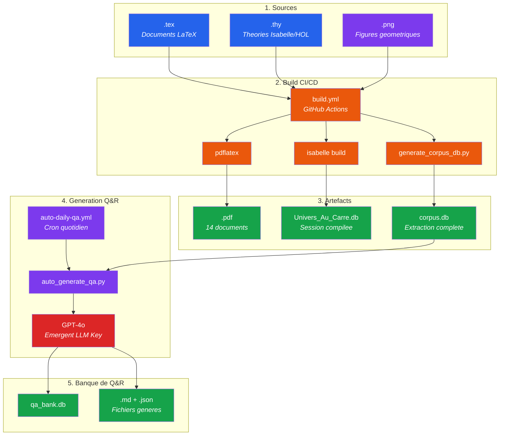
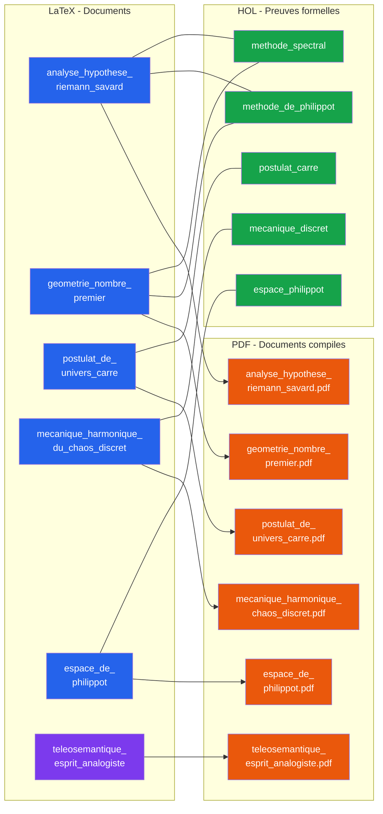

# Arborescence globale de la theorie

## L'Univers est au Carre -- Philippe Thomas Savard

**Generee le :** 2026-04-13

---

## Vue d'ensemble

| Categorie | Nombre |
|-----------|--------|
| Fichiers .tex | 10 |
| Fichiers .thy | 5 |
| Fichiers .pdf | 14 |
| Total fichiers | 29 |
| Total pages PDF | 499 |

---

## Architecture globale du depot

```mermaid
graph TD
    ROOT["repo_savard/"]

    ROOT --> SRC["src/"]
    ROOT --> QA["qa_bank/"]
    ROOT --> SCRIPTS["scripts/"]
    ROOT --> GH[".github/workflows/"]
    ROOT --> IA["Ia_geo_spec_prem_app_deplo/"]
    ROOT --> DOCS["docs/"]

    SRC --> TEX["tex/<br/><i>10 fichiers .tex</i>"]
    SRC --> HOL["hol/<br/><i>5 fichiers .thy + ROOT</i>"]
    SRC --> PDF["pdf/<br/><i>14 fichiers .pdf</i>"]
    SRC --> ARB["arborescences_corpus/<br/><i>4 fichiers .md</i>"]

    QA --> QADB["qa_bank.db"]
    QA --> CORPUS["corpus.db"]
    QA --> QCAT["CATALOGUE.md"]

    SCRIPTS --> QAGEN["auto_generate_qa.py"]
    SCRIPTS --> CORPGEN["generate_corpus_db.py"]

    GH --> BUILD["build.yml"]
    GH --> CRON["auto-daily-qa.yml"]

    style ROOT fill:#4a4a4a,color:#fff
    style SRC fill:#2563eb,color:#fff
    style QA fill:#16a34a,color:#fff
    style SCRIPTS fill:#ea580c,color:#fff
    style GH fill:#7c3aed,color:#fff
    style IA fill:#dc2626,color:#fff
    style DOCS fill:#555,color:#fff
    style TEX fill:#3b82f6,color:#fff
    style HOL fill:#3b82f6,color:#fff
    style PDF fill:#3b82f6,color:#fff
    style ARB fill:#3b82f6,color:#fff
    style QADB fill:#16a34a,color:#fff
    style CORPUS fill:#16a34a,color:#fff
    style QCAT fill:#16a34a,color:#fff
    style QAGEN fill:#ea580c,color:#fff
    style CORPGEN fill:#ea580c,color:#fff
    style BUILD fill:#7c3aed,color:#fff
    style CRON fill:#7c3aed,color:#fff
```



---

## Schema de flux complet : du source a la Q&R



---

## Interdependances entre les 3 couches



---

## Correspondances completes

| Concept | .tex | .thy | .pdf |
|---------|------|------|------|
| Analyse hypothese Riemann | `analyse_hypothese_riemann_savard.tex` | -- | `analyse_hypothese_riemann_savard.pdf` |
| Espace de Philippot | `espace_de_philippot.tex` | `espace_philippot.thy` | `espace_de_philippot.pdf` |
| Geometrie nombre premier | `geometrie_nombre_premier.tex` | -- | `geometrie_nombre_premier.pdf` |
| Geometry prime spectrum (EN) | `geometry_prime_spectrum.tex` | -- | `geometry_prime_spectrum.pdf`, `geometrie_du_spectre_premier.pdf` |
| Mecanique harmonique chaos | `mecanique_harmonique_du_chaos_discret.tex` | `mecanique_discret.thy` | `mecanique_harmonique_du_chaos_discret.pdf`, `mecanique_chaos_discret.pdf` |
| Methode de Philippot | -- | `methode_de_philippot.thy` | -- |
| Methode spectrale | -- | `methode_spectral.thy` | -- |
| Philosophy prime number (EN) | `pilosophy_geometry_of_prime_number.tex` | -- | `pilosophy_geometry_of_prime_number.pdf` |
| Postulat univers carre | `postulat_de_univers_carre.tex` | `postulat_carre.thy` | `postulat_de_univers_carre.pdf`, `postulat_univers_carre.pdf` |
| Prime number geometry (EN) | `prime_number_geometry.tex` | -- | `prime_number_geometry.pdf` |
| Teleosemantics (EN) | `teleosemantics_mind_analogist_philosophy.tex` | -- | `teleosemantics_mind_analogist_philosophy.pdf` |
| Teleosemantique (FR) | `teleosemantique_philosophie_esprit_analogiste.tex` | -- | `teleosemantique_philosophie_esprit_analogiste.pdf`, `telosemantique_analogiste_spectre_premier.pdf` |

---

## Hierarchie du depot

```
repo_savard/
|
|-- .github/workflows/
|   |-- build.yml                  (CI : compilation PDF + HOL + corpus.db)
|   |-- auto-daily-qa.yml         (Cron : generation quotidienne Q&R)
|
|-- src/
|   |-- tex/                       (10 documents LaTeX source)
|   |-- hol/                       (5 theories Isabelle/HOL + ROOT)
|   |-- pdf/                       (14 documents PDF compiles)
|   |-- arborescences_corpus/      (4 schemas Mermaid.js)
|
|-- qa_bank/
|   |-- qa_bank.db                 (Base de donnees Q&R)
|   |-- corpus.db                  (Extraction complete du corpus)
|   |-- CATALOGUE.md               (Index des Q&R generees)
|
|-- scripts/
|   |-- auto_generate_qa.py        (Generateur Q&R avec LLM)
|   |-- generate_corpus_db.py      (Extracteur de corpus vers SQLite)
|
|-- Ia_geo_spec_prem_app_deplo/    (Application web des 3 IAs collaboratives)
|-- docs/                          (Documentation supplementaire)
|-- SCRIPT_NARRATIF.md             (Script narratif V2 de la theorie)
|-- README.md                      (Presentation du depot)
```

---

*Generee depuis le depot complet -- 29 fichiers source, 5 theories, 14 PDF, 499 pages*
