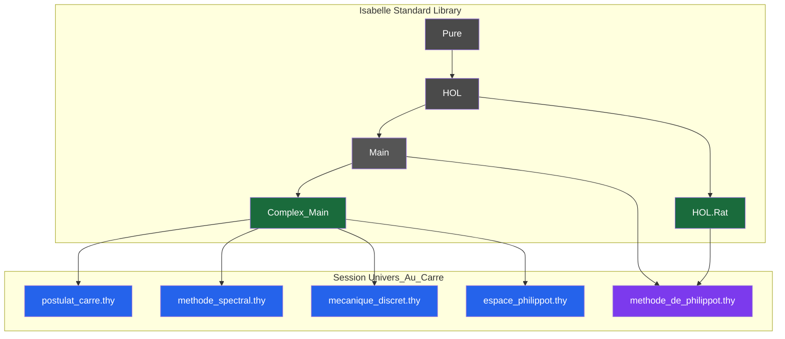
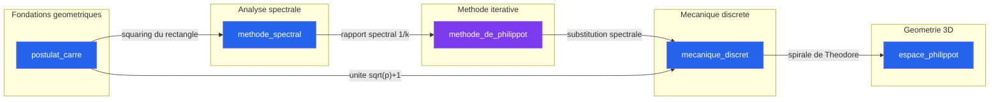
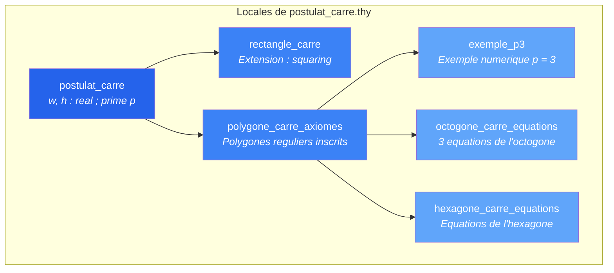
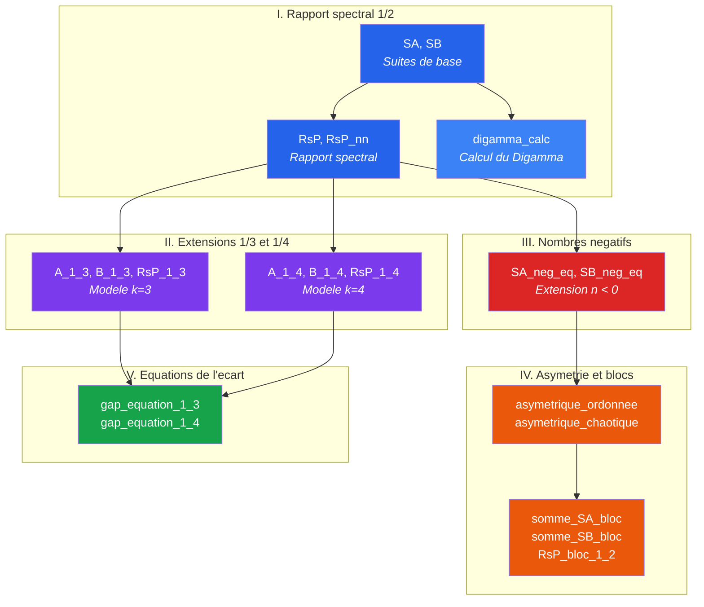
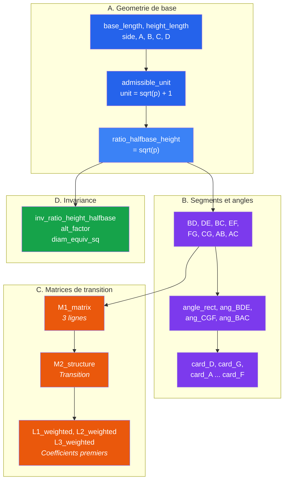
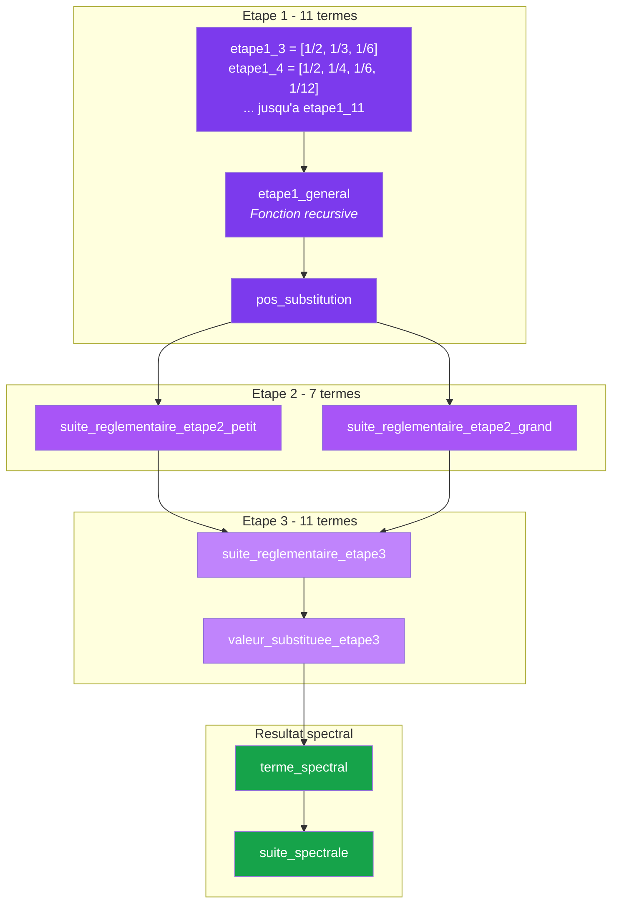
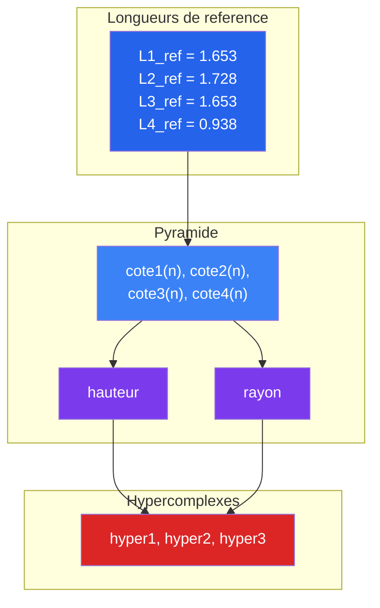

# Arborescence logique HOL

## Session Isabelle : Univers_Au_Carre

**Generee depuis :** `Univers_Au_Carre.db` (session HOL compilee)
**Session :** `Univers_Au_Carre`
**Return code :** 0 (compilation reussie)
**Heap d'entree :** `Pure` → `HOL`

---

## Schema de dependances des theories

**Legende :**
- **Vert** : Bibliotheques Isabelle standard (`Complex_Main`, `HOL.Rat`)
- **Bleu** : Theories importees depuis `Complex_Main` (analyse complexe)
- **Violet** : `methode_de_philippot.thy` utilise `Main` + `HOL.Rat` (nombres rationnels) au lieu de `Complex_Main`

---

## Architecture conceptuelle de la session

---

## Detail par theorie

### postulat_carre.thy

| Propriete | Valeur |
|-----------|--------|
| Import | `Complex_Main` |
| Locales | 6 |
| Definitions | 19 |
| Axiomes | Oui (multiples axiomatisations) |

**Definitions principales :**

| Definition | Description |
|-----------|-------------|
| `unit_p` | Unite symbolique de la theorie |
| `ratio_height_square` | Rapport hauteur au carre |
| `ratio_trunc_square` | Rapport troncature au carre |
| `area_rect` | Aire du rectangle |
| `area_square` | Aire du carre maximal inscrit |
| `rect_equiv_square` | Equivalence rectangle-carre |
| `eq_postulat` | Equation du postulat |
| `polygone_defini` | Definition du polygone regulier |
| `postulat_eq` | Equation principale du postulat |

---

### methode_spectral.thy

| Propriete | Valeur |
|-----------|--------|
| Import | `Complex_Main` |
| Locales | 0 |
| Definitions | 90+ |
| Axiomes | 15+ axiomatisations |

**Theorie la plus dense du corpus.**

**Axiomes fondamentaux :**

| Axiome | Enonce |
|--------|--------|
| Equation premiere | Pour tout n >= 1 et p premier : `prime_equation(n, p) = p` |
| Rapport negatif 1/2 | Pour n1, n2 <= -1, n1 != n2 : `RsP_neg(n1, n2) = 1/2` |
| Rapport negatif 1/3 | Pour n1, n2 <= -1, n1 != n2 : `RsP_neg_1_3(n1, n2) = 1/3` |
| Rapport negatif 1/4 | Pour n1, n2 <= -1, n1 != n2 : `RsP_neg_1_4(n1, n2) = 1/4` |
| Gap 1/3 | Validation : 227 / 173 |
| Gap 1/4 | Validation : 947 / 881 |
| Spectral final | Il existe P tel que `P_spectral(n) = P` et `A(n) + B(n) >= 1` |
| Zeros de Riemann | Pour tout rho (zero de zeta) : `Re(rho) = 1/2` |

---

### mecanique_discret.thy

| Propriete | Valeur |
|-----------|--------|
| Import | `Complex_Main` |
| Locales | 0 |
| Definitions | 60+ |
| Axiomes | 3 axiomatisations |

**Axiomes :**

| Axiome | Enonce |
|--------|--------|
| Ratio fondamental | Si `admissible_unit(p)` et n >= 1 : `ratio_halfbase_height(n, p) = sqrt(p)` |
| Invariance | `AL_nat(p) != 0` et l'unite geometrique coincide avec `sqrt(p) + 1` |
| Alt factor | `alt_factor(p) = 1 / sqrt(p)` |

---

### methode_de_philippot.thy

| Propriete | Valeur |
|-----------|--------|
| Import | `Main`, `HOL.Rat` |
| Locales | 0 |
| Definitions | 32 |
| Fonctions | 1 (`etape1_general`) |

---

### espace_philippot.thy

| Propriete | Valeur |
|-----------|--------|
| Import | `Complex_Main` |
| Locales | 0 |
| Definitions | 13 |
| Axiomes | 5 axiomatisations |

**Axiomes :**

| Axiome | Enonce |
|--------|--------|
| Spirale de Theodore | Il existe f tel que pour tout n : `r(f(n)) = sqrt(n)` |
| Valeur geometrique | Il existe u, v tel que `val_geom(n) = sqrt(u(n)) + v(n)` |
| Norme hypercomplexe | `N(a, b, c, d) = sqrt(a^2 + b^2 + c^2 + d^2)` |
| Pyramide-ellipsoide | Pour tout n : `V_ell(n) = 10 * V_pyr(n)` |
| Position spirale | `spiral_pos(n, e) = F(a(n), b(n), c(n), d(n), e)` |

---

*Generee depuis Univers_Au_Carre.db -- Session Isabelle 2024 -- Compilation reussie (return code 0)*
